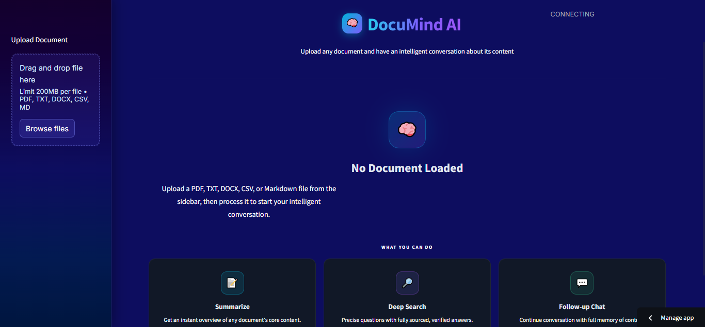
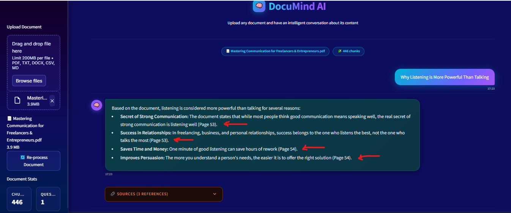

# DocuMind AI

[Live Demo](https://chat-with-file.streamlit.app/)

**DocuMind AI** is an AI-powered document assistant that turns static files into interactive conversations. Upload a document, ask questions in natural language, and get focused, context-aware answers grounded in the uploaded content.

Instead of manually scrolling through long PDFs and dense text files, DocuMind AI helps users extract meaning faster through intelligent retrieval, source-backed answers, page-aware references, and a clean chat experience.

---

## Overview

DocuMind AI is built for one core purpose: **make documents easier to understand**.

The product allows users to upload supported files, process them into searchable chunks, and interact with them through a conversational interface. Every answer is generated from the uploaded document only, which keeps the system grounded, useful, and transparent.

This is not a generic chatbot pretending to know everything.  
It is a document-focused AI assistant designed to answer from the file in front of it.

---

## Live App

**Try it here:**  
[https://chat-with-file.streamlit.app/](https://chat-with-file.streamlit.app/)

---

## Screenshots

### Home Page

The home page is designed to feel clean, focused, and direct. It introduces the product clearly and keeps the user’s attention on a single action: upload a document and start an intelligent conversation.

The sidebar acts as the document control area, where users can upload supported files and begin processing them. The center of the interface presents the product identity, the purpose of the app, and a simple starting point for the overall workflow.

This screen reflects the core philosophy of DocuMind AI: keep the experience simple, reduce friction, and let the document become the center of the conversation.

---

### Question Answering Interface

This screen shows the main strength of DocuMind AI.

After a document is uploaded, the system processes it into **chunks**. Those chunks are converted into embeddings, stored in a vector index, and used for semantic retrieval. When the user asks a question, the assistant does not search the document like a basic keyword finder. Instead, it retrieves the most relevant embedded chunks and generates an answer from that retrieved context.

The answer is grounded only in the uploaded file. It also includes **page references**, showing exactly where the information came from inside the document. That makes the response more trustworthy, easier to verify, and more useful for study, review, and research.

The interface also exposes a **references section**, which gives additional source-backed context and helps users trace the answer back to the original content. This matters because a smart answer without evidence is just decoration. DocuMind AI is built to show both the answer and the trail behind it.

---

## What DocuMind AI Does

- Uploads and processes documents into searchable knowledge
- Splits content into chunks for better retrieval quality
- Uses embeddings to search semantically through the file
- Answers questions using only uploaded document context
- Shows page-level references for where the answer was found
- Provides source snippets and references for verification
- Supports follow-up conversation through contextual chat memory

---

## Why It Matters

Traditional document search is clumsy. It depends on exact keywords, manual scanning, and too much patience. That works fine until the file becomes long, technical, repetitive, or poorly structured.

DocuMind AI changes that experience by turning the document into something interactive.

Instead of hunting through pages, users can ask:
- what the main idea is
- what the key points are
- where a specific concept is explained
- what the document says about a topic
- which pages support a claim

That makes the product useful for students, researchers, freelancers, analysts, and anyone dealing with information-heavy files.

---

## Core Product Experience

### 1. Upload
Users upload a file from the sidebar.

### 2. Process
The document is parsed, cleaned, and divided into meaningful chunks.

### 3. Embed
Each chunk is converted into vector embeddings so the document becomes semantically searchable.

### 4. Retrieve
When a question is asked, the system retrieves the most relevant chunks from the uploaded file.

### 5. Answer
The language model generates an answer grounded in that retrieved context.

### 6. Reference
The response includes page-aware references and supporting source snippets so users can see where the answer came from.

---

## Key Features

- **Document Chat** — ask questions naturally and get grounded answers
- **Chunk-Based Retrieval** — process files into searchable semantic units
- **Embedded Search** — retrieve meaning, not just matching words
- **Page References** — show where the answer was found in the file
- **Source Visibility** — expose references and snippets for trust and traceability
- **Follow-Up Memory** — continue the conversation with context awareness
- **Modern UI** — clean interface built for focus and readability

---

## Supported File Types

DocuMind AI is built around a document-first workflow and supports formats such as:

- PDF
- TXT
- DOCX
- CSV
- Markdown

---

## Product Strengths

What makes DocuMind AI useful is not just that it answers questions.

It answers with **retrieval-backed context**, **embedded search**, **page-level grounding**, and **visible references**. That moves it beyond the usual “chatbot demo” and turns it into a practical document intelligence tool.

In real use, that means:

- less guessing
- better traceability
- more confidence in answers
- faster verification
- easier learning from long documents

---

## Use Cases

DocuMind AI is well suited for:

- summarizing long documents
- exploring PDFs through natural language
- reviewing reports and business material
- extracting insights from course notes
- asking targeted questions from research documents
- locating evidence inside written content
- understanding dense files without reading every page manually

---

## Technology Stack

### Frontend
- **Streamlit**
- **Custom CSS**

### AI and Retrieval
- **LangChain**
- **Google Gemini**
- **Sentence Transformers**
- **FAISS**

### Document Processing
- **PyPDF**
- **python-docx**
- **docx2txt**
- **Unstructured**

### Supporting Tools
- **Python**
- **Pandas**
- **Tiktoken**
- **dotenv**

---

## Design Philosophy

DocuMind AI is built around clarity.

The interface avoids clutter, the answers stay grounded in the uploaded file, and the product keeps the workflow simple: upload, process, ask, verify.

That simplicity is deliberate. Most document tools either bury the user in menus or give flashy answers with no proof. DocuMind AI aims for the middle ground that actually matters: strong retrieval, readable UI, and answer transparency.

---

